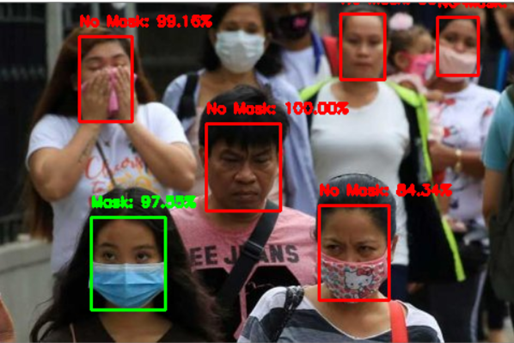

# Face Mask Detection using Convolutional Neural Network

In the late December 2019, a previous unidentified coronavirus, currently named as the 2019 novel coronavirus, emerged from Wuhan, China, and resulted in a formidable outbreak in many cities in China and expanded globally, including Thailand, Republic of Korea, Japan, United States, Philippines, Viet Nam, and our country (as of 2/6/2020 at least 25 countries). Covid-19 are Person-to-person transmission may occur through droplet or contact transmission and if there is a lack of stringent infection control or if no proper personal protective equipment available, it may jeopardize the first-line healthcare workers.

The best safety measure that can be taken is enforcing the people to wear face mask whenever they are outside to slow down the covid-19 infection rate. Mask wearing significantly reduced the amounts of various airborne viruses coming from infected patients, measured using the breath-capturing "Gesundheit II machine" developed by Dr. Don Milton, a professor of applied environmental health and a senior author of the study published April 3 in the journal Nature Medicine. In short, masks can help prevent the spread of COVID-19 and that the more people wearing masks, the better. 

As for now, you as a Data Scientist or Machine Learning Engineer or Practitioner are going to use AI technique to recognize people whether they are wearing face mask or not in the public or open space. 



## Project Overview
In this project, we are going to reuse and modified some parts of the template in order for it to suit with our project. The overview of the whole project would be:


## Environment Setup

Step 1: Go to this site and download the anaconda installer for windows
+ https://docs.anaconda.com/anaconda/install/windows/

Step 2: Open anaconda termianl and create an anaconda environment
```conda create --name aipm python=3.6```

Step 3: Activate the created environment
```conda activate aipm```

Step 4: Clone the repository
```git clone https://github.com/oneacademy/ML-Template-Jupyter.git```

Step 5: Change directory to the cloned directory
```cd ML-Template-Jupyter```

Step 6: Install all the python requirements.txt
```pip install –r requirements.txt```

